## About

Our group is interested in the analysis and prediction of complex traits and diseases using genetic (integrating pedigrees, genomics, and other omics) and environmental information. Our research involves methods, software development, and applications in human health, plant and animal breeding. Most of us are affiliated with the [Department of Epidemiology and Biostatistics at Michigan State University](http://www.epi.msu.edu/).

## Projects

**Genomic Analysis and Prediction of Complex Traits**. Development and evaluation of methods and software for analysis and prediction of complex traits using high-dimensional genomic data (e.g., SNPs, genotyping by sequencing, and other types of sequence data). Our research in this area has focused on the use of shrinkage and variable selection in parametric models, as well as on the use of some semi-parametric methods (e.g., RKHS).

**Genomics x Environment**. Development of methods for integrating high-dimensional genomic and environmental data in a unified framework. We have developed methods that can model interactions between high-dimensional marker panels and high-dimensional environmental covariates. These methods were originally developed and tested with data from wheat trails. We are currently extending some of these methods for analysis of complex human traits and diseases.

**Integration of Data from Multiple Omics Layers**. Development of models and software for integrating high-dimensional multi-layer omics data. Our focus is on methods that can integrate whole-omics profiles and can model interactions between two or more high-dimensional predictor sets (e.g., genome-by-methylome interactions). We are currently working on using these methods for prediction of breast cancer outcomes and in plant omics applications.

**Software development for analysis of big omics data**. We have developed several R packages for genetic analysis using pedigrees, genomes and other omics (see software below for further details).

**Genomic Analysis of Obesity and Response to Exercise**. We maintain an active collaboration with researchers from the [TIGER (Training Interventions and Genetics of Exercise Response)](http://tigerstudy.org/) study, developing and implementing methods for the identification of genetic factors influencing Body Composition and Response to Exercise Intervention.

## Software

**BGLR**. The Bayesian Generalized Linear Regression R package implements a variety of shrinkage and variable selection methods. The package can be used with whole-genome data (e.g., SNPs, gene expression or other omics), pedigrees and non-genetic covariates, including high-dimensional environmental data. \[[Article](https://www.genetics.org/content/198/2/483)\] \[[CRAN](https://CRAN.R-project.org/package=BGLR)\] \[[Source Code](https://github.com/gdlc/BGLR-R)\]

**BGData**. A suite of R packages to enable analysis of extremely large genomic data sets (potentially millions of individuals and millions of molecular markers). \[[Article](https://www.g3journal.org/content/9/5/1377)\] \[[CRAN](https://cran.r-project.org/package=BGData)\] \[[Source Code](https://github.com/quantgen/BGData)\]

**pedigreemm**. An R package for analysis of complex traits and diseases using generalized linear mixed models using likelihood methods. \[[Article](https://pubmed.ncbi.nlm.nih.gov/19820058/)\] \[[Documentation](https://cran.r-project.org/web/packages/pedigreemm/pedigreemm.pdf)\] \[[CRAN](https://cran.r-project.org/package=pedigreemm)\]

**pedigreeR**. R functions related to pedigrees. \[[Source Code](https://github.com/Rpedigree/pedigreeR)\]

**MTM**. Implements a Bayesian Multi-Trait Gaussian models with user defined-(co)variance structures. \[[Documentation](https://github.com/QuantGen/MTM/wiki)\] \[[Source Code](https://github.com/QuantGen/MTM)\]

## Activities

- [Journal Club Meetings](https://github.com/QuantGen/LAB-Journal-Club-Meetings)

## People

### Agustín González Reymúndez

- Title: PhD Student
- Email: [agugonrey@gmail.com](mailto:agugonrey@gmail.com)
- Areas of Interest: Genomic tools for QTL mapping and genomic prediction, with applications in human genetics and plant breeding

### Alexa Lupi

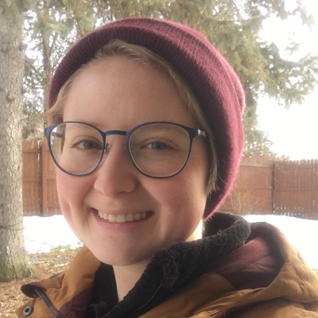

- Title: PhD Student
- Email: [lupialex@msu.edu](mailto:lupialex@msu.edu)
- Areas of Interest: Biostatistics, Statistical Genetics, Epidemiology

### Alexander Grueneberg

- Title: Programmer
- Email: [gruenebe@msu.edu](mailto:gruenebe@msu.edu)
- Areas of Interest: Software Development
- Links: [Website](https://agrueneberg.info), [GitHub](https://github.com/agrueneberg), [Google Scholar](https://scholar.google.com/citations?user=j14410QAAAAJ)
- Software: [BGData](https://github.com/QuantGen/BGData)

### Ana I. Vazquez

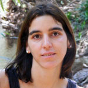

- Title: Assistant Professor
- Email: [avazquez@msu.edu](mailto:avazquez@msu.edu)
- Areas of Interest: Statistical Genetics, Animal Breeding, Software Development
- Links: [Website](https://www.epi.msu.edu/faculty/vazquez), [GitHub](https://github.com/anainesvs)
- Software: [pedigreemm](https://CRAN.R-project.org/package=pedigreemm), [Rpedigree](https://github.com/Rpedigree)

### Anirban Samaddar

- Title: PhD Student
- Email: [samadda1@msu.edu](mailto:samadda1@msu.edu)
- Areas of Interest: Bayesian Statistics, Time Series, Statistical Genetics

### Fernando Aguate

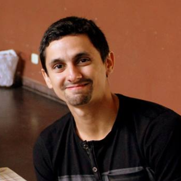

- Title: Postdoc
- Email: [fmaguate@gmail.com](mailto:fmaguate@gmail.com)
- Areas of Interest: Biostatistics, Statistical Genetics, Plant Breeding, Software Development
- Links: [Website](https://feraguate.github.io), [GitHub](https://github.com/FerAguate), [Google Scholar](https://scholar.google.com/citations?user=Bp6h9gEAAAAJ&hl=en)
- Also joined us as a visitor in 2016 while at Facultad de Ciencias Agropecuarias, Universidad Nacional de Córdoba (Argentina)

### Filipe Couto

- Title: Postdoc
- Email: [coutoal1@msu.edu](mailto:coutoal1@msu.edu)
- Areas of Interest: Biostatistics, plant Breeding, genome-wide association studies and prediction of complex traits in plants

### Gabriel Rovere

- Title: Postdoc
- Email: [roverega@msu.edu](mailto:roverega@msu.edu)
- Areas of Interest: Animal Breeding. Livestock Genetic Evaluations, Horse Breeding, Breeding Goals.

### Guanqi Lu

- Title: PhD Student
- Email: [luguanqi@msu.edu](mailto:luguanqi@msu.edu)
- Areas of Interest: Statistical Genetics, Biostatistics

### Gustavo de los Campos

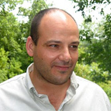

- Title: Associate Professor
- Email: [gdeloscampos@gmail.com](mailto:gdeloscampos@gmail.com)
- Areas of Interest: Statistical Genetics, Plant and Animal Breeding, Software Development
- Links: [Website](https://www.epi.msu.edu/faculty/deloscampos), [Google Scholar](https://scholar.google.com/citations?user=fRjGwkwAAAAJ), [GitHub](https://github.com/gdlc)
- Software: [BLR](https://CRAN.R-project.org/package=BLR), [BGLR](https://www.genetics.org/content/198/2/483), [BGData](https://github.com/QuantGen/BGData), [MTM](https://github.com/QuantGen/MTM), Genomic Selection

### Harold Wu

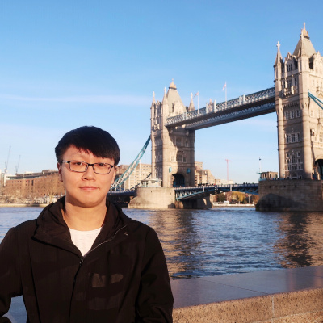

- Title: PhD Student
- Email: [wuhao12@msu.edu](mailto:wuhao12@msu.edu)
- Areas of Interest: Statistical Genetics, Statistical Modeling, Clinical Trials

### Marco López-Cruz

- Title: PhD Student
- Email: [malctony@hotmail.com](mailto:malctony@hotmail.com)
- Areas of Interest: Biostatistics, Statistical Genetics, Plant Breeding

### Paulino Pérez

- Title: Associate Professor
- Email: [perpdgo@gmail.com](mailto:perpdgo@gmail.com)
- Areas of Interest: Biostatistics, Software Development
- Links: [Google Scholar](https://scholar.google.com/citations?user=6FoMrm4AAAAJ)
- Software: [BLR](https://cran.r-project.org/package=BLR), [BGLR](https://www.genetics.org/content/198/2/483), [ars](https://cran.r-project.org/package=ars), [brnn](https://cran.r-project.org/package=brnn)

## Past Members

### C. Austin Pickens

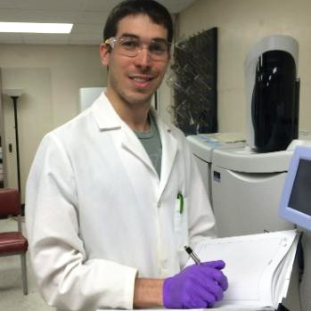

- Title: Doctoral Candidate
- Email: [picken21@anr.msu.edu](mailto:picken21@anr.msu.edu)
- Areas of Interest: Novel biomarker discovery using mass spectrometry-based lipidomics and disease prediction
- Links: [GitHub](https://github.com/AustinPickens), [ResearchGate](https://www.researchgate.net/profile/Charles_Pickens2)

### Deniz Akdemir

- Title: Postdoc
- Email: [deniz.akdemir.work@gmail.com](mailto:deniz.akdemir.work@gmail.com)
- Areas of Interest: Data Mining, Multivariate Statistics, Statistical Genetics, Animal and Plant Breeding

### Felix Enciso

- Title: PhD Candidate
- Email: [encisofe@msu.edu](mailto:encisofe@msu.edu)
- Areas of Interest: Genome-wide association and genome selection studies for complex traits in potato, genetic engineering in potato using CRIPRS/Cas9 technology
- Links: [GitHub](https://github.com/fenciso13), [Publications](https://www.researchgate.net/profile/Felix_Enciso)

### Hank Wu

- Title: Master Student
- Email: [wukuanha@msu.edu](mailto:wukuanha@msu.edu)
- Areas of Interest: Biostatistics

### Hwasoon Kim

- Title: Postdoc
- Email: [kimhwaso@msu.edu](mailto:kimhwaso@msu.edu)
- Areas of Interest: Biostatistics, Clinical Trials
- Links: [Website](http://www.hwasoon.kim/), [GitHub](https://github.com/dulcisflos)

### Lian Lian

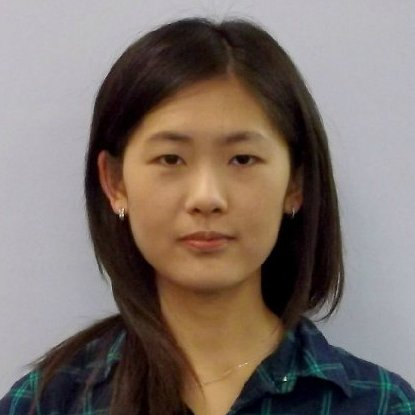

- Title: Postdoc
- Email: [lianl0501@gmail.com](mailto:lianl0501@gmail.com)
- Areas of Interest: Statistical Genetics, Plant Breeding

### Mengying Sun

- Title: Research Assistant
- Email: [msun@epi.msu.edu](mailto:msun@epi.msu.edu)
- Areas of Interest: Statistical Modeling
- Links: [GitHub](https://github.com/mengyings)

### Michael P. Behring

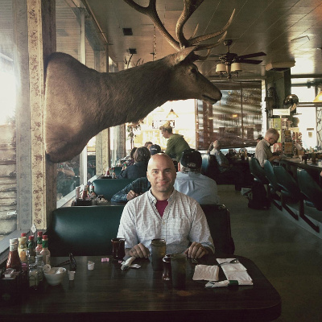

- Title: PhD Candidate
- Email: [behringm@uab.edu](mailto:behringm@uab.edu)
- Areas of Interest: Epidemiology, Genetics of Cancer

### Paige Duren

- Email: [durenpai@msu.edu](mailto:durenpai@msu.edu)
- Areas of Interest: Nursing

### Raka Mandal

- Title: PhD Student
- Email: [mandalr1@msu.edu](mailto:mandalr1@msu.edu)
- Areas of Interest: Biostatistics, Statistical Learning, Bayesian Statistics

### Scott Funkhouser

- Title: PhD Student
- Email: [sfunkhouser@gmail.com](mailto:sfunkhouser@gmail.com)
- Areas of Interest:  Software development for multiple omics layers, genomic prediction
- Links: [Website](http://scottafunkhouser.com), [GitHub](https://github.com/funkhou9)
- Software: [editTools](https://github.com/funkhou9/editTools)

### Shyamali Mukerjee

- Title: Master Student
- Email: [smukerjee@epi.msu.edu](mailto:smukerjee@epi.msu.edu)
- Areas of Interest: Statistical Genetics, Application of Statistical Methods to Public Health Issues

### Siddharth Avadhanam

- Title: Master Student
- Email: [avadhana@msu.edu](mailto:avadhana@msu.edu)
- Areas of Interest: Statistical Genetics, Biostatistics, Bioinformatics

### Yeni Liliana Bernal Rubio

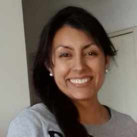

- Title: Postdoc
- Email: [ylbernal@msu.edu](mailto:ylbernal@msu.edu)
- Areas of Interest: Statistical Genetics, Genomic Evaluation Complex Traits, Software Development
- Software: [Meta-Analysis GWA from GBLUP](http://tinyurl.com/BLUPMA), [GWA from GBLUP models](https://github.com/steibelj/gwaR)

### Yogasudha Veturi

- Title: PhD Candidate
- Email: [sudhaveturi@gmail.com](mailto:sudhaveturi@gmail.com)
- Areas of Interest: Biostatistics, Statistical Genetics, Plant Breeding

## Visitors

### 2018

#### Cecilia Salvoro

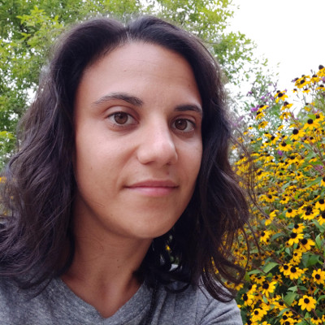

- Email: [cecilia.salvoro@gmail.com](mailto:cecilia.salvoro@gmail.com)
- Affiliation: Department of Biology, University of Padova, Padova, Italy
- Areas of Interest: Human Genetics, Next-generation Sequencing, Genetic Mapping of Diseases, Prediction of Eye Color
- Links: [ResearchGate](https://www.researchgate.net/profile/Cecilia_Salvoro)

#### Maria Martinez Castillero

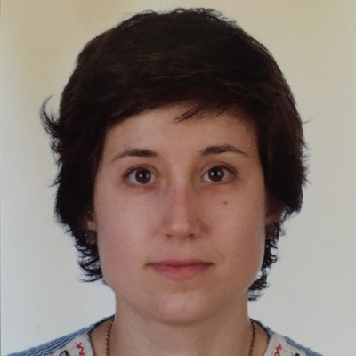

- Email: [mmartinezcastillero@gmail.com](mailto:mmartinezcastillero@gmail.com)
- Affiliation: University of Padova (Italy)
- Areas of Interest: Quantitative genetics, programming, animal science
- Links: [LinkedIn](https://www.linkedin.com/in/mmartinezcastillero)

#### Pernille Bjarup Hansen

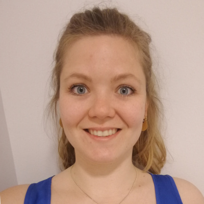

- Email: [pernille.bjarup@mbg.au.dk](mailto:pernille.bjarup@mbg.au.dk)
- Affiliation: Department of Molecular Biology and Genetics, Aarhus University, Flakkebjerg, Denmark
- Areas of interest: Plant genetics, quantitative genetics, abiotic stress and plant breeding

### 2017

#### Muhammad Yasir Nawaz

- Email: [nawazmuh@msu.edu](mailto:nawazmuh@msu.edu)
- Areas of Interest: Genomic prediction, Livestock breeding, Application of statistical methods to public and animal health issues

### 2016

#### Hugo O. Toledo Alvarado

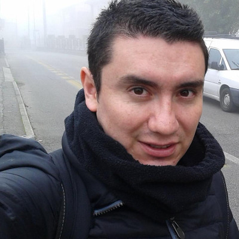

- Email: [h.toledo.a@gmail.com](mailto:h.toledo.a@gmail.com)
- Affiliation: Università degli studi di Padova (Italy)
- Project: The use of Fourier-Transform Infrared (FTIR) Spectra as an innovative tool for predicting fertility traits in dairy cattle

#### M. Angeles Pérez-Cabal

- Email: [mapcabal@vet.ucm.es](mailto:mapcabal@vet.ucm.es)
- Affiliation: Complutense of University of Madrid (Spain)
- Areas of Interest: Animal Breeding

### 2015

#### Juan Pablo Gutierrez Garcia

- Email: [gutgar@ucm.es](mailto:gutgar@ucm.es)
- Affiliation: Complutense of University of Madrid (Spain)
- Areas of Interest: Animal Breeding and Conservation Genetics
- Links: [Website](https://www.ucm.es/info/prodanim/html/JP_Web.htm)

### 2014

#### Christina Lehermeier

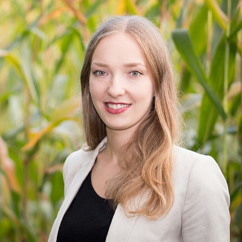

- Email: [christina.lehermeier@tum.de](mailto:christina.lehermeier@tum.de)
- Affiliation: Plant Breeding, Technische Universität München (Germany)
- Areas of Interest: Statistics, Quantitative Genetics, Plant Breeding
- Links: [Google Scholar](https://scholar.google.de/citations?user=YhpaEaYAAAAJ), [TUM Plant Breeding](https://www.plantbreeding.wzw.tum.de/en/startseite/)

#### Swetlana Berger

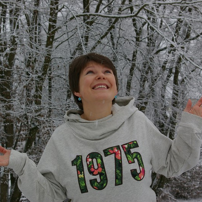

- Email: [swmiller@gwdg.de](mailto:swmiller@gwdg.de)
- Affiliation: Georg-August-Universität Göttingen (Germany)
- Areas of Interest: Scale effects in genomic modelling and prediction

